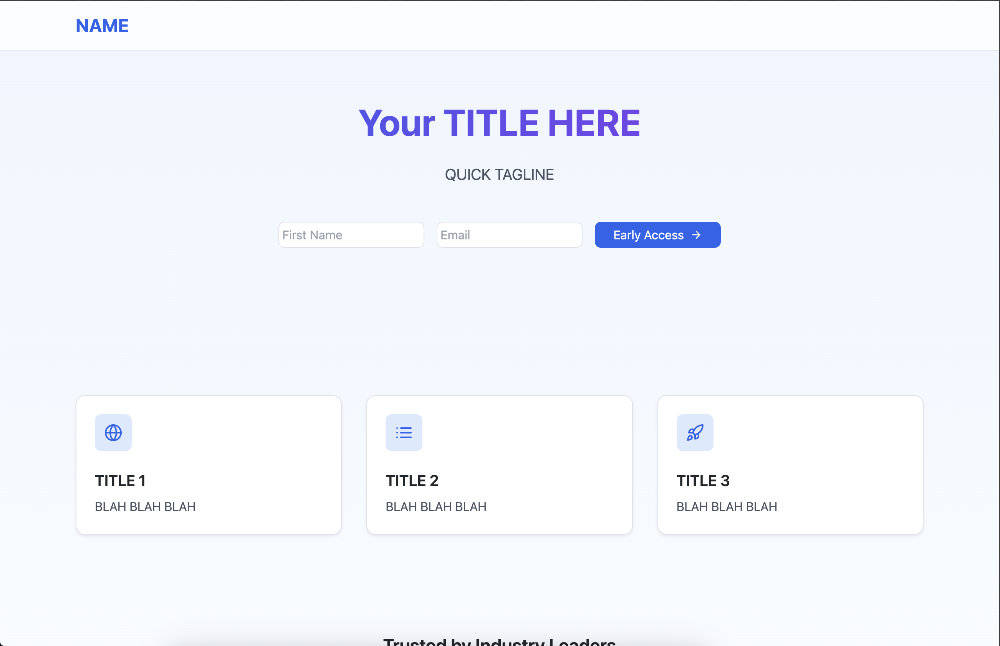
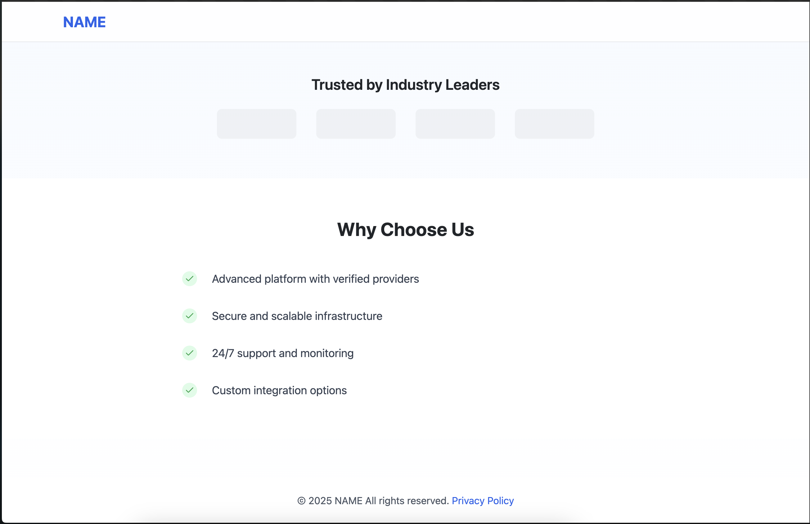

# Wailist Page Template

Template designed to quickly build a waitlist page to collect emails and validate ideas.

Utilizes Github Actions and Ansible to build Docker images to quickly deploy onto an AWS EC2 Debian instance.

{: .mx-auto}
{: .mx-auto}

## Technologies

- Containerization: Docker/Docker Compose

- Frontend: React/Next.js

- Backend: FastAPI

- Frameworks/Libraries: uv, TailwindCSS

## Prerequisites

- Fill out your platform's details in `src/constants.ts` 

```js
const Constants = {
    platformName: "NAME", // The name of your app/platform/etc
    contactEmail: "contact@xxx.com", // Your contact email
    backendApiURL: "http://localhost:8000/api/subscribe", // The URL you want to hit for the backend - from AWS/GCP/ETC
};
```

- Copy `.env.example` and rename it to `.env`, fill out the API KEY from Twillio [SendGrid](https://sendgrid.com/en-us/resource/setting-up-your-email-infrastructure-with-twilio-sendgrid)


- Create a Dockerhub account/repo and fill out the Github repo environmental variables:

  - DOCKERHUB_TOKEN
  - DOCKERHUB_USERNAME
  - DOCKERHUB_REPO

- Complete the `config.yaml` and the `inventory.yaml` in the `ansible` directory

  - `github_repo`: Github repo clone address
  - `deploy_path`: Path where to clone the repo to on the server
  - `deploy_command`: `Make` command to run to deploy on the server

- Add your domain in HOSTNAME_PROD in the `Makefile`

## Deployment

### Local Deployment

Uses `make` to quickly dispatch `docker-compose` commands.

- `deps`: rebuilds the frontend to deploy statically using the api

- `build`: builds the container using `docker-compose build `

- `up-prd`: ups the container using `docker-compose -f docker-compose.yml up`

- `up-dev`: ups the container using `docker-compose -f docker-compose.yml -f docker-compose.dev.yml up`
  which will deploy with local volumes.

Ex: `make deps build up-dev`

### Server Deployment

Easy deployment using `make setup deploy` after completing the required config files.

- `setup`: Install dependencies and clone repo onto server

- `deploy`: Deploy on server

To use a SSL certificate, uncomment the volumes under the `traefik` service. Add your own certificates for use in Traefik.

```yaml
volumes:
  - "/var/run/docker.sock:/var/run/docker.sock:ro"
  - "./dynamic_conf.yaml:/etc/traefik/dynamic_conf.yaml"
  - "/etc/letsencrypt/live/domain/fullchain.pem:/etc/certs/ssl-cert.pem"
  - "/etc/letsencrypt/live/domain/privkey.pem:/etc/certs/ssl-cert.key"
```
